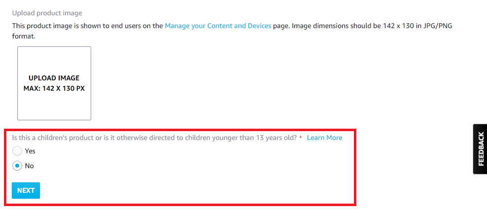

# Alexa-AVS-Android
Alexa Voice Service (AVS) is integrated for answering questions by Alexa after handwriting questions. The input of the question is to use the handwriting recognition input method, use Android TextToSpeech to convert the text to speech, and use HttpURLConnection to communicate with Alexa to get the voice of the answer.

Alexa Voice Service (AVS) 整合用於手寫問題後由 Alexa 回答問題的答案。問題的輸入是使用手寫辨識輸入法，使用 Android TextToSpeech 把文字轉換為語音，使用 HttpURLConnection 與 Alexa 進行溝通得到答案的語音。

(本項目為測試用，並沒有優化 Source code)

# Run Environment
    - Android 9

# Permission - AndroidManifest.xml
Need to open Android Apps Setting storage device permissions.

```java
    <uses-permission android:name="android.permission.INTERNET" />
    <uses-permission android:name="android.permission.WRITE_EXTERNAL_STORAGE" />
    <uses-permission android:name="android.permission.READ_EXTERNAL_STORAGE" />
```

# Technology
    - Handwriting IME
    - TextToSpeech
    - NanoHTTPD
    - Alexa Voice Service (AVS)
    
# Alexa Voice Service (AVS) Developer Console
   * How to get the "Client ID" and "Client secret" required by Apps?
   * How to setting virtual device?
   
   1. You need to apply for an AVS account. [URL](https://developer.amazon.com/en-US/alexa/devices/alexa-built-in/development-resources/sdk)
   2. Enter the AVS Developer Console. [URL](https://developer.amazon.com/alexa/console/avs/home)
   3. Products -> "MANAGE YOUR PRODUCTS". 
   <p align=center></p>
   
   4. click "ADD NEW PRODUCT" button. [URL](https://developer.amazon.com/alexa/console/avs/products)
   <p align=center></p>
    
   5. Product information.
      - Input Product name and Product ID. ex. test_device (Can be the same) 
      - Please select your product type. -> Application with Alexa built-in
      <p align=center></p>
      
      - Product category -> Mobile Apps
      - Brief product description -> application
      - How will end users invoke Alexa with your product? -> Touch-initiated
      <p align=center></p>
      
      - Is this a children’s product or is it otherwise directed to children younger than 13 years old? -> Select No
      - click Next button.          
      <p align=center></p> 
   
   6. Select a Security Profile or Create a new Security Profile
   <p align=center></p>
   <p align=center></p>
   
   7. Platform information -> Web
   8. Allowed origins -> Input the text "http://localhost:9745/"
   9. Allowed return URLs -> Input the text "http://localhost:9745/authresponse"
   10. Click "FINISH" button.
   11. Copy "Client ID" and "Client secret" into the APP. Replace with your content.
   <p align=center></p>
   
   * Amazon changed the layout of Web content in the past.
    
# Reference
  [AlexaNotificationCurl](https://github.com/gravesjohnr/AlexaNotificationCurl/blob/master/README.md)  
  [Alexa Voice Command](https://www.cnet.com/home/smart-home/every-alexa-command-you-can-give-your-amazon-echo-smart-speaker-or-display/)  
  [Alexa Voice Service (AVS) with cURL](https://miguelmota.com/blog/alexa-voice-service-with-curl/)  
  [HttpURLConnection](http://www.tastones.com/zh-tw/stackoverflow/android/httpurlconnection/upload_post_file_using_httpurlconnection/)
  
